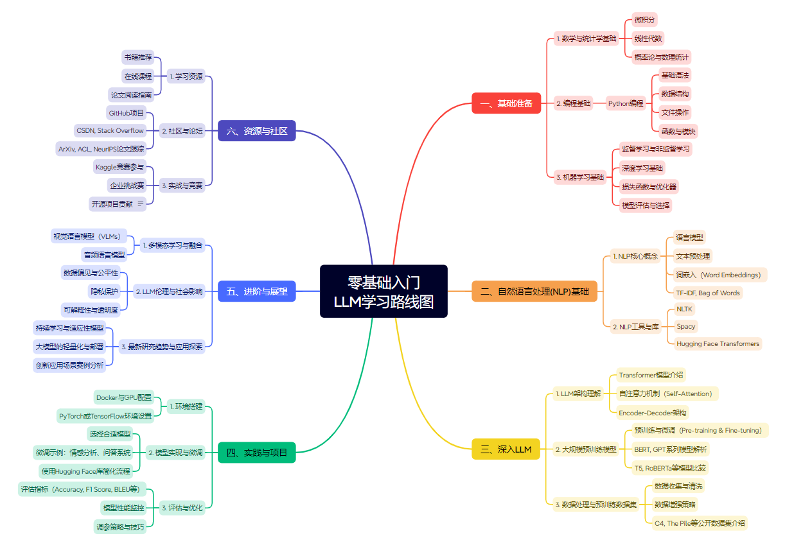

# 大模型学习手册 🔥

>你好，我是[陆金所]的AI条线负责人，主要负责大模型、AI中台、AI外呼和AI质检的建设。

---

## 一、介绍

`💥为什么？`

2023年从 `ChatGPT` 大火之后，AI已经成为诸多人关注的焦点，不管是在新闻、股市还是音乐、电影、游戏等，都充斥着AI的影子。

作为一名在一线的AI应用负责人，模型充斥在我生活、工作的方方面面，并且作为一名`理科生`，对数字充满了兴趣。但当前互联网上有关于LLM的各种教程、知识、视频的内容参差不齐，充满了各种数学符号，让人望而却步。

所以，顺手记录**成系列体系**的`《大模型学习手册》`内容，我责无旁贷！哈哈哈：

- 尽量以零基础为出发点，通过较为形象的表述来让各位能学习到大模型相关的所有知识。
- 包括以下几个方面：`Markdown规范`、`Python基础`、`预训练模型发展历史（NLP）`、`深入LLM`、`上手LLM`、`进阶LLM`、`相关资源`等。

💋`鉴于技术讨论的原则`，如果内容有误或者不恰当的地方可以提issue或通过邮箱告知哈，旨在共同学习、成长，Peace。

## 二、 适合人群

1. 具备一定的数字知识，因为其中会涉及到部分线性代数的内容
2. 对技术要求不高的同学
3. 有一颗Peace&Love的心

## 三、 我能学到什么

如果你是个AI领域的专家，请用批判的眼光来审视这个学习手册，并专业的提出你的建议，⚠️注意不是骂街。

如果你是个AI小白，**千万不要害怕在学习的过程中遇到问题，这些都是正常的！** 希望你可以一直坚持把这些内容事必躬亲、亲历亲为的学完，加油！

## 四、问题交流

- Mailto:mini_yuu@foxmail.com
- WeChat:165375115 备注：`学习LLM`

 

    <a href="https://github.com/The-Way-to-AI/The-Way-to-AI.github.io">如果对你有帮助，请关注我</a>

   

