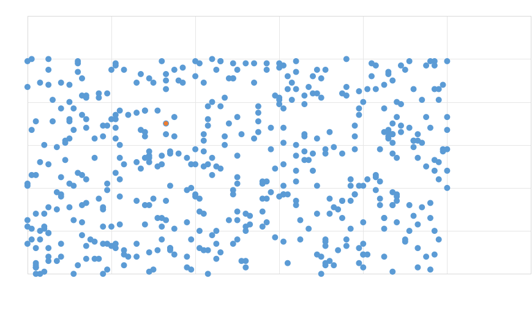
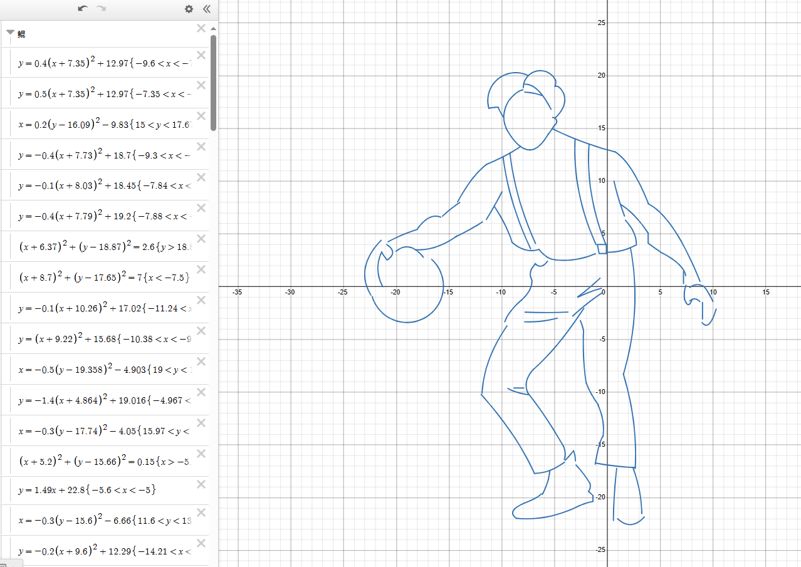

# 什么是模型
## 模型是什么
前面我们说到，划分之前数据中的房价，可以通过一条直线去完成，也就是：

$$y = Wx + b$$

但如果数据过多，从而让我们无法找到这样一条直线呢？比如：划分图中蓝色、橙色的点

或者换个问题，为什么是**直线**，**曲线**行不行？**正方形**可不可以？

当然可以，这里的选择**直线、曲线、或者其他什么乱七八糟的线、或者形状**，就是我们所说的`模型`

假如说模型选错了，那再怎么算也是不对的，所以找到一个合适的模型**至关重要**。

只要变量够多、够复杂，理论上可以表示一切，它甚至可以表示一个人。。

## 坤模型 🤣
链接：https://www.desmos.com/calculator/parora1w5s?lang=zh-CN

