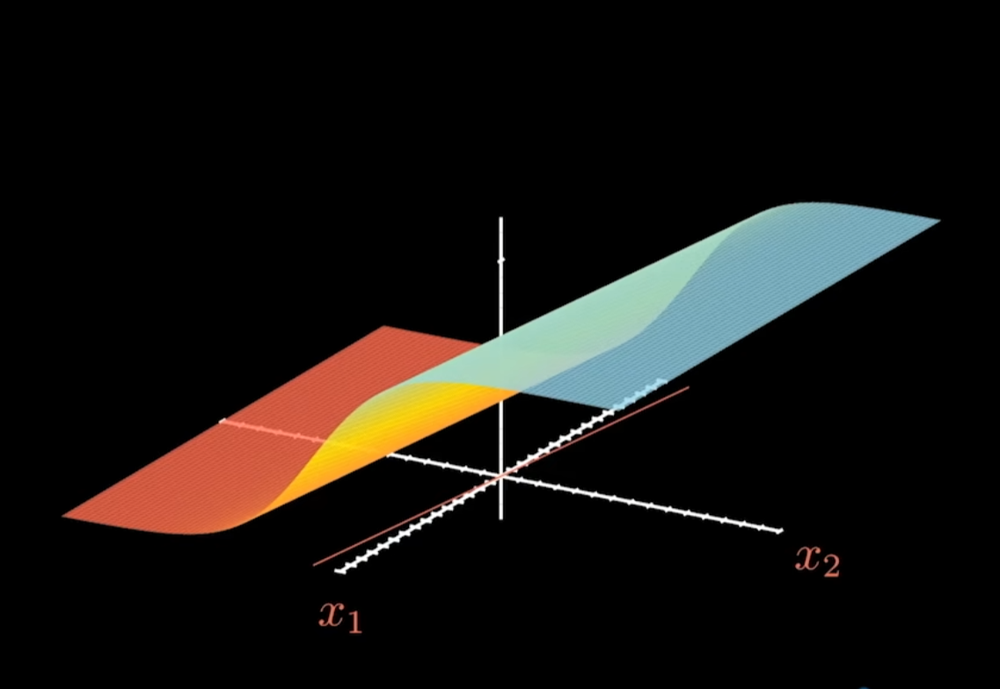
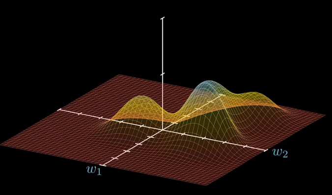

# 反向传播

*上面这个图，是一个简单的神经网络在空间上的函数图像，其中的$X_1$,$X_2$都是输入，换句话说是一组未知数。*

如果是在训练阶段，$X_1$,$X_2$其实是已知的，如果我们把未知数换成$W_1$,$W_2$，$b$，那么就可以得到一个函数，函数如下：  
$$f(W_1,W_2,b)=X_1W_1+X_2W_2+b$$

那我们把坐标轴换成$W_1$,$W_2$，则图像也会有响应的变化，如下：
  
*上面这个图，是$f(W_1,W_2,b)$在$W_1$,$W_2$上的函数图像，$X_1$,$X_2$是已知的，$W_1$,$W_2$是未知的。*

> [!TIP]
> 假设我们这里的策略是找到概率最大的或者说间隔最大的$W_1$,$W_2$

那么我们需要找到的$W_1$,$W_2$则是上图中的`最高点`（可能是最高\最低，具体看策略是什么）

但$W_1$,$W_2$的初始化是随机的，有可能出现在图上任意一点，我们需要找一个方法来使我们知道当前的$W_1$,$W_2$是好还是不好，这里可能比较难理解，我们先看一个简答的例子：  
*假设现在我们正在玩一个猜数字的游戏，裁判心中想了一个数字，你有10次机会猜这个数字，每次猜完之后，裁判会告诉你这个数字是大于还是小于你猜的数字，你猜的数字是正确的时候，就会告诉你猜对了，这里有几个因素会影响你的胜率：*
- 首次猜的数字是多少：这个影响胜率的因素之一，如果初始的数字与裁判心中数字相差不大，那么你猜的次数就会少很多，反之则会多很多。
- 每次修正的时候，数字的选择方法【即：裁判告诉你数字大了，你需要往小了猜，但比这个数字小的数字有很多，你如何抉择？】  

在神经网络中，我们需要找到隐藏的裁判，它就是 **梯度下降法**

## 梯度下降法

在上图中的任意一点的切面总是指向**上升最快**的方向，也就是最高点。这个切面中的那条切线就是一个向量，这个向量在$W_1$,$W_2$的投影，就是`梯度`。  
那么，问题来了为什么是下降而不是上升呢？这是因为为了统一而已，在具体问题中即使是找最小值，也会通过梯度下降法来求解，只不过会加一个`负号`。因为本质上是一个方法。
> [!TIP]
> 这里需要注意的时，这个向量是指向**上升最快**的方向，而不是直接指向最高点，这里有本质区别，**类似与垂直于等高线的感觉**

在确定好这个梯度后，可以根据梯度分解出关于$W_1$,$W_2$的向量，这样就能确定下一次$W_1$,$W_2$的取值了

### 学习率

到这里，仍然有问题，确定了方向，那在这个方向上要前进多少呢？就像刚才的猜数字游戏，是一步一步的小步走，还是跳跃一大步？
这就是我们要聊到的`学习率`，它属于一个超参数，这也就是我们常听说的`调参`，属于算法老师日常**炼丹**的一部分

- 学习率过小：这就和我们的猜数字游戏一样，虽然肯定可以找到最优解，但需要尝试的次数多、时间慢
- 学习率过大：也是猜数字游戏一样，假设固定以5为一个单位去猜，10错了，就猜5或者15。虽然可以比较快的解决最优解，但会在最优解附近反复横跳。假设最优是7，那么要么是5要么是10，完全无法找到最优解。用专业的话术就是**无法收敛**
