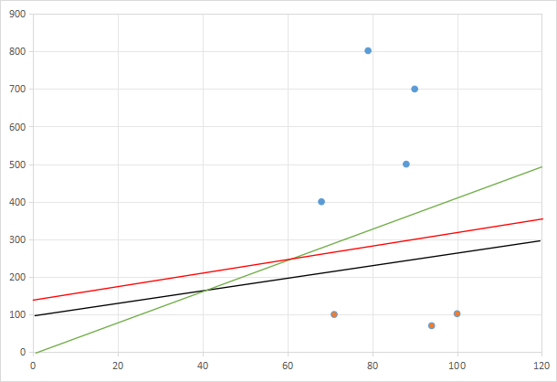
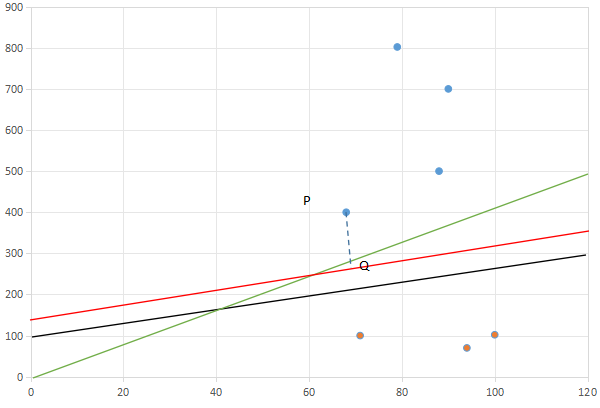

# 怎么找到这个规律？

## 还是原来的问题
### 还记得我们之前的那个问题吗？

- 1. 如何找到这个函数？
- 2. 怎么评价这个函数，或者说找到这个函数之后，这个函数是否合适，上面例子中的函数是 $y = 5x + 101$ 可不可以呢？

在已确定的数据集上，可能有很多条线去分割数据，如下图：

那究竟是**红色的**、**绿色的**还是 **黑色的** 更好呢？

### 假设的提出

从本质上看，上图三个线段的区别就是线段对**每个数据的距离**，那这里有个问题是，这个距离有两种选择：
- 越大越好
- 越小越好

要解决这个问题，需要明白我们最初的目标是什么？机器学习的目标是预测一个新数据属于哪个类别，并且是`越准越好`，那`准`的体现就是能兼容的新数据`多`，所以我们需要选择`越大越好`

## 假设一：所有数据到直线的垂直距离最小的那个越大越好
-
我们已知的有下几个信息：
- 每个具体数据（就比如之前的表格）
- 那个规律，也就是$f(x)$

那如何通过这两个已知条件来确定这个距离？这里我们需要用到`勾股定理`

以下过程采用`定义法`推导

假设$Ax+By+C=0$是我们的直线L，点P为对应的数据$(x_0,y_0)$，Q为直线上的点，PQ为直线上点P到直线的垂直距离，那么：

- PQ这条垂线的斜率为$B/A$ ➡️ 因为直线L的斜率是$-A/B$  
- 因为PQ与直线L垂直相交，所以可以得出Q点的坐标 ➡️ 简单的一元二次方程式推导  
- P点坐标与Q点坐标均为已知的，那可以通过勾股定理算出PQ的长度 ➡️ 勾股定理  
最终得出：

我们需要把所有的数据都带入上方的公式，把求出最小值，即：$min(PQ)$  
厉害的小伙伴已经发现了，其实PQ的分子就是把**数据带入直线L的函数中**，而分母则是与**勾股定理。**  

就此，我们可以将PQ扩展到更高维度 ➡️ 因为他们都是线性问题  
-
## 假设二：最大似然估计

要理解这个最大似然需要通过一个例子：  
*假如有一个罐子，里面有黑白两种颜色的球，数目多少不知，两种颜色的比例也不知。我 们想知道罐中白球和黑球的比例，但我们不能把罐中的球全部拿出来数。现在我们可以每次任意从已经摇匀的罐中拿一个球出来，记录球的颜色，然后把拿出来的球 再放回罐中。这个过程可以重复，我们可以用记录的球的颜色来估计罐中黑白球的比例。假如在前面的一百次重复记录中，有七十次是白球，请问罐中白球所占的比例最有可能是多少？*  
答案是：`70%`，可能有人一口就说出来的。  
但问题是`50%`行不行？毫无疑问可以，如果你还是没有理解。  
那`1%`行不行？也可以，因为我就是天选之子，就是那么巧，每次都拿到那个1%的白球:sunglasses: 

**最大似然估计的目标就是要选出那个最平凡的小伙伴**，也就是`70%`

所以，假设我们有一个函数$P(x)$,可以用于计算那个**最平凡的小伙伴**出现的概率，那我们需要求的就是当$P(x)$最大的时候对应的直线，即：$MaxP(x)$
> 这里为什么没有实际的函数$P(x)$呢？那是因为计算这个$P(x)$的方法有很多，常见的有$sigmoid$等等，都可以用于计算这个概率，但$P(x)$不同，则得出的具体值也会不同，也就是那个**小伙伴**会不同。  
> 在**高度复杂的问题**里，可能找到张三、也可能找到李四，这取决于$P(x)$

## 假设三：方差估计（这个有点纯理解）

还是刚才的房价数据，这些我们把问题变得复杂点：  

### 假设函数

现在空间中有100个点，代表100个城市的数据，现在需要把这100个城市的数据分类出来。
假设一个函数：$T(x)$，这个函数可以完美的区分出这100个城市，但是这个函数会异常的复杂，或者说在三维空间中已经没有办法画出来了（或者说很难）。
### 叠加函数

那我们可以把这个$T(x)$叠加一个噪声$Z$（或者说是干扰），直到这个 $T(x)+Z$变成一个三位空间中可以画出来（也不一定是画出来，只要能理解就行），但这时候这个变化后的函数的输出已经变了，已经不能完美的分割这100个城市了，这是因为噪声的带来的误差，这个**误差是我们希望它越小越好**，也就是所说的**方差**

## 总结
- 可以有很多假设，不限于这三种
- 假设不同，那结果就不同
- 没有理论上的标准答案，需要具体问题具体分析
- 所有的假设都有一个共同点，就是将最原始的$f(x)$在假设条件下进行量化，量化后再进行判断好与不好
- 量化$f(x)$后的值并没有现实意义，只是用来比较
- 但量化的结果是给$f(x)$赋予的现实意义，比如用**假设一**量化出来的$f(x)$就是垂直距离最大，就是能涵盖更多的未知数据
- 是一种经验的总结