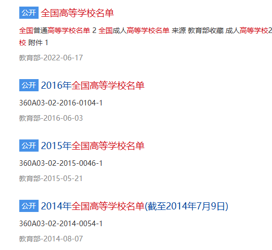

# 数据获取 - 实战
在实际业务场景中，数据往往不是原封不动的在某个系统里等你，实际情况往往比较复杂，大体分为以下几类：
- 数据源是公司内部系统
- 数据源是公司合作的第三方系统
- 数据源是在公网
## 数据收集 - 以国内大学的专业数据为例
此处以国内大学的专业数据为例，介绍数据收集阶段的注意事项和具体落地方案。
## 需要考虑的因素
- **多样性：** 专业数据往往可以在诸多地方找到，比如国家教育部官方网站、各大学的官方网站、第三方网站、搜索引擎等等
- **质量：** 数据源的多样性带来数据质量上的差异，但不可否认的是各类第三方数据源往往都是在原始数据源上加工而来，因其目的不同可能`数据的侧重点不同`
- **法律合规：** 公网的数据源可能隶属不同地区管辖，其地区的不同对`数据保护的制度`可能是不同的
- **后续要求：** 对特定的下游任务而言，对数据的格式可能有不同的要求，虽然可以在预处理阶段再统一进行格式化，但最好在收集阶段就要有所考虑从而方便后续预处理工作的开展，比如明明是一个NLP任务，但数据收集出来缺是一个图片
- **成本：** 成本是一个可能会忽视的因素，虽然不太会影响算法的训练结果，但会直接觉得项目是否有足够的性价比去投产

## 数据收集方案
| 方法 | 优点 | 缺点 |
| --- | --- | --- |
| **爬虫** | - 自由<br>- 自动<br> | - 法律风险<br>- 可能随时需要变更 |
| **官方API接口** | - 没有法律顾虑<br>- 稳定<br>- 数据靠谱 | - 可能没有渠道<br>- 没钱<br> |
| **数据库订阅** | - 较为稳定<br>- 靠谱<br> | - 贵 |
| **公共数据集** | - 即开即用 | - 时效性不行<br>- 数据质量不行 |


当前还是以考虑质量和效率的阶段，优先级建议是：
官方API ➡️ 数据库订阅 ➡️ 爬虫 ➡️ 公共数据集

> 但在此阶段，建议是做`多选`

## 高校名单获取
在数据库中，高校是一个最高的维度，所以首先需要知道都有哪些高校，调研发现教育部会在每年六月份在网站公布高效名单：  
  

### 建立初始化数据
使用 2024 最新数据发布链接：http://www.moe.gov.cn/jyb_xxgk/s5743/s5744/A03/202406/t20240621_1136990.html


```python
import numpy as np
# 先下载文件转为CSV格式并命名为123123.csv
university_data_file = 'C:/Users/zyn/Desktop/123123.csv'
university_data_list = np.loadtxt(university_data_file, delimiter=',', dtype=str)
print(university_data_list)
```
### 定时任务
因每年高效名单都有增减，所以需要建立一个定时任务，去获取moe.gov.cn的网站中titile为`XXXX全国高等学校名单`并定期更新数据

## 专业获取

这里重点以`爬虫`为例，其他途径（API对接等）更多的是商务方面的工作，具体步骤：
- 获取高校网址list
- 爬取专业数据
- 存储

### 获取高效网址

可以从学信网的阳光高考中获取，学信网是教育部官方的网站，数据质量可信度都比较高，可以获取到所有高校的网址，具体步骤：
- 获取学信网阳光高考的网址：https://gaokao.chsi.com.cn/gdwz.do
- 爬取所有高校网址
  - 初步看了下目标网站，应该要模拟点击，建议使用可视化框架
- 建立高校网站和刚才university_data_list的对应关系

## 爬取专业数据

根据刚才的数据，可以获取到每个高校的网址，然后爬取专业数据来获取数据