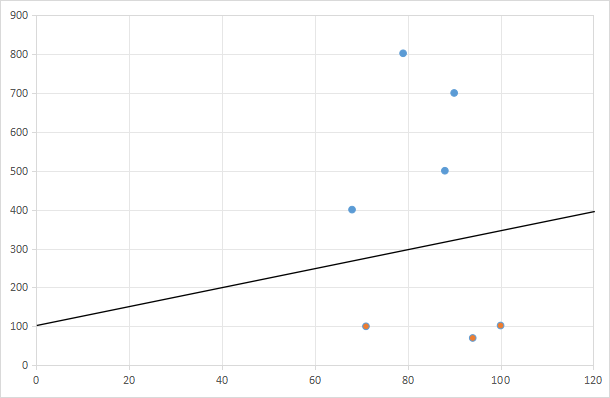

# 如何做机器学习

还是之前的例子，预测房价的问题

|地区|房价|面积|
|-|-|-|
|深圳|500|88|
|东莞|102|100|
|深圳|700|90|
|深圳|802|79|
|东莞|70|94|
|东莞|100|71|
|深圳|400|68|

我们总结了可以通过一个简单的线性函数来拟合这些数据，即：
```math
y=wx+b
```

但是，**这并不是机器学习最后的结果**，因为上述函数中的$x$和$y$都是其中的变量，我们真正的目的是通过这两个变量来分类（划分城市）,故需要把函数做一层变化：

$$f(x)=W_1x_1+W_2x_2+b$$


- ***这里的$x_1$和$x_2$是我们的变量，即房价和面积。***
- ***这里的$f(x)$是拟合的函数，即我们的分类函数，是深圳还是东莞，在这里很明显的是$>0$的是深圳，$<0$的是东莞。***

很明显，这在平面中是一条直线，即：



**但如果我们增加一个变量**，这个变量有可能是朝向、街道类型、是否是商业区等等，那么把函数变成：

$$f(x)=W_1x_1+W_2x_2+W_3x_3+b$$

`那么这个函数在空间上的形状可以如下图所示`，用一个平面去分割了两个区域


- ***图上的点和面都是随机生成，不需要纠结为什么不是和上面表格一样，只是表达一个意思而已***

显然，如果变量越多，那这个函数在`更高维度`上的形状就是更复杂的，我们可以通过向量来表示这个函数，即：  


$$
f(x)=W_1x_1+W_2x_2+...+W_nx_n+b=
\begin{bmatrix}
W_1 & W_2 & W_3....W_n\\ 
\end{bmatrix}
\cdot
\begin{bmatrix}
x_1 \\ 
x_2 \\ 
x_3\\
....\\
x_n\\ 
\end{bmatrix}
+b
$$


其实，$`b`$也可以认为是一个$bx_b$，只不过这个$x_b$是固定的，且$x_b=1$而已。


