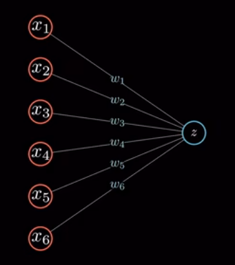
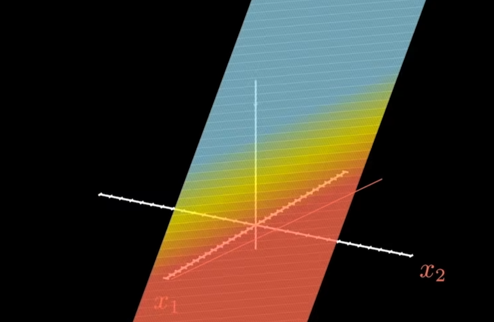
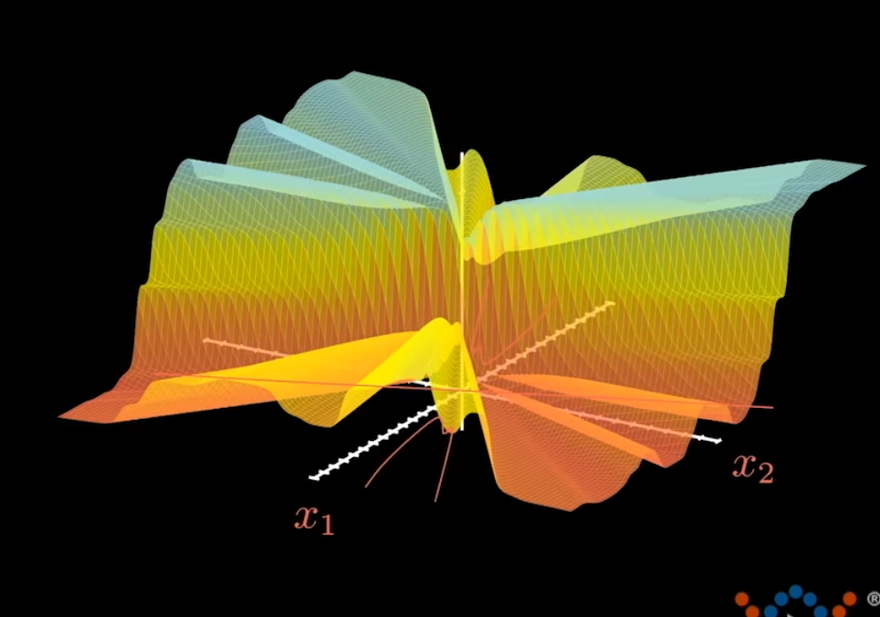

# 神经网络

## 什么是神经网络
我理解的神经网络，是`一种提高模型复杂程度的方法`，刚才的平面或者说线性模型，只能预测线性关系，而神经网络可以**预测非线性关系**。它通过增加神经元数量，来增加模型的复杂度，从而提高模型的预测能力。
## 非线性关系
对小白来说，非线性关系可能很难从简单的这几个字中表述就能理解，一两个维度可能还好，比如$y=x^2$，但是随着维度的增加，非线性关系就难理解了，比如$y=x^2+x^3$，$y=x^2+x^3+x^4$

但我认为一切还是源于生活，想象一下，你是一个新手川菜厨师。此时你想做一碗重庆酸辣粉，如果你只知道加醋，每次加固定量的醋，那么最终的味道只能是醋味的线性变化。但现实中的美食往往需要复杂的调味，比如酸辣粉需要加盐才会让风味更佳，这就是为什么酸中还带咸的原因，这些不同味道的组合会产生全新的、无法简单叠加的风味。这就像是神经网络中的非线性关系

## 最简单的神经网络

还是之前的例子：

$$z = W_1x_1+W_2x_2+...+W_nx_n+b$$

**用神经网络来表达**：

其中：
- 输入层：$x_1,x_2,...,x_n$
- 输出层：$z$

 但别忘了，之前我们有[讲过](https://the-way-to-ai.github.io/#/md/idea-plugin/%E6%80%8E%E4%B9%88%E6%89%BE%E5%88%B0%E8%BF%99%E4%B8%AA%E8%A7%84%E5%BE%8B?id=%e5%81%87%e8%ae%be%e4%b8%89%ef%bc%9a%e6%96%b9%e5%b7%ae%e4%bc%b0%e8%ae%a1%ef%bc%88%e8%bf%99%e4%b8%aa%e6%9c%89%e7%82%b9%e7%ba%af%e7%90%86%e8%a7%a3%ef%bc%89)还需要一个函数来完善这个$z$，或者说给这个$z$加一个噪声（激活函数），我们常见的激活函数有$SIGMOD$、$ReLU$、$LeakyReLU$、$tanh$、$softmax$等，我们这里用$SIGMOD$

 >有朋友可能想问，不需要这个什么激活函数可不可以实现预测的目的。答案是**可以**。但预测的结果有准有不准，我们的目的是让预测结果更准。通过引入激活函数来增加神经网络模型的非线性，以便增加对样本非线性关系的拟合能力。
 换个更直白的说法就是，激活函数在空间上改变了$z$的形状，让这个$z$在多方向上更贴合原始数据。

## SIGMOD
公式：
$$SIGMOD(z) = \frac{1}{1+e^{-z}}$$

$SIGMOD$函数从公式上开是一个$(0,1]$的取值区间，随着z的值越大，函数的值就越大，当z=0时，函数的值是0.5。
>但这个函数也存在一个问题，就是e的-z次方决定了函数的大小，所以实际上它是一个指数变化的函数，不可避免的会存在梯度爆炸或者消失的问题（也就是我们常说的斜率太大或太小）。

## 直观感受

总结：最简单的神经网络，有两个组成部分
- $z = W_1x_1+W_2x_2+...+W_nx_n+b$
- $SIGMOD(z) = \frac{1}{1+e^{-z}}$

在图像上的表示就是（假设只有2维，因为维度太多就画不出来了:cry:）：

但，如果没有$SIGMOD(z) = \frac{1}{1+e^{-z}}$，那纯$z$，就是下面这张图：

## 多层神经网络

刚才我们只是最简单的2维单层神经元，如果增加神经元个数可以使函数在空间上的图像更贴合原始数据，也就是更复杂。

比如下面这个图：

 