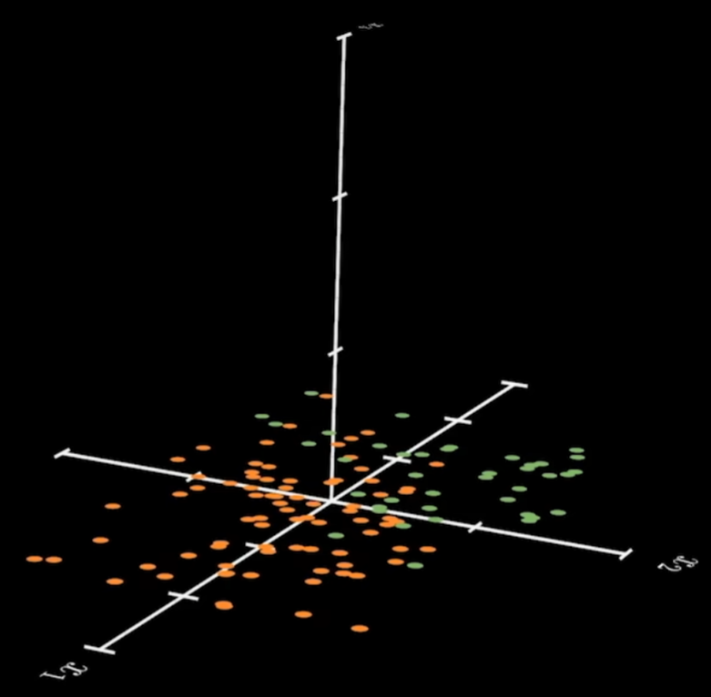
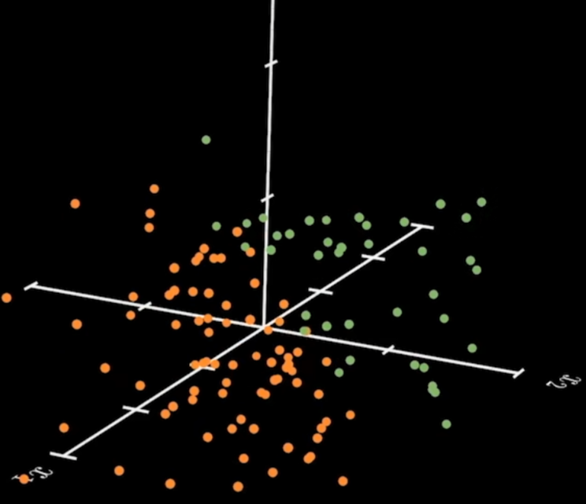
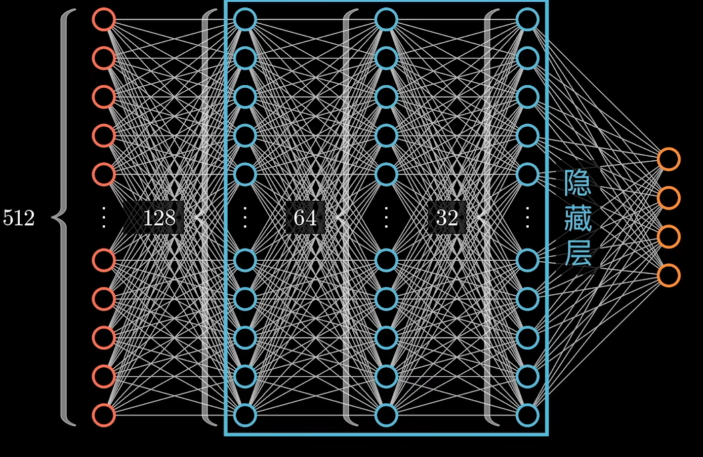

# 神经网络的理解

## 升维

假如一个二维数据集，在二维平面中根本无法找出合适的函数将其分开，比如如下数据：

但如果通过一个隐藏层（神经元）给他们在空间上分开，即升维：
  
则可以比较容易得从空间中找到一个函数将其分开  
> 所以升维，可以看做是对数据的整体进行非线性的变换，从而找出一个合适的函数

## 降维

如果所有神经网络的隐藏层都采用升维的理解去看，那可能没法覆盖所有的场景。

假设有一个超高维度的数据，比如 中国经济的发展数据，但发展数据中可能有可能涵盖几百甚至上千个特征，这个时候我们就需要降维，这个降维的过程可以理解成对数据的“抽象”，即将相同含义的数据压缩到一起，如下：

> 隐藏层的数量决定了对神经网络原始数据的抽象程度
>

## 总结

所以一个神经网络，是通过一个输入层、一个或多个隐藏层和一个输出层来完成数据的处理，而神经网络的隐藏层，可以理解为对数据的抽象或空间变换，通过隐藏层，神经网络可以更好的处理（理解）数据，从而达到更好的效果。

> [!NOTE]
> 还记得我们最初的问题吗？如何找到这个隐藏层的函数呢？这里需要引入一个概念叫**反向传播**