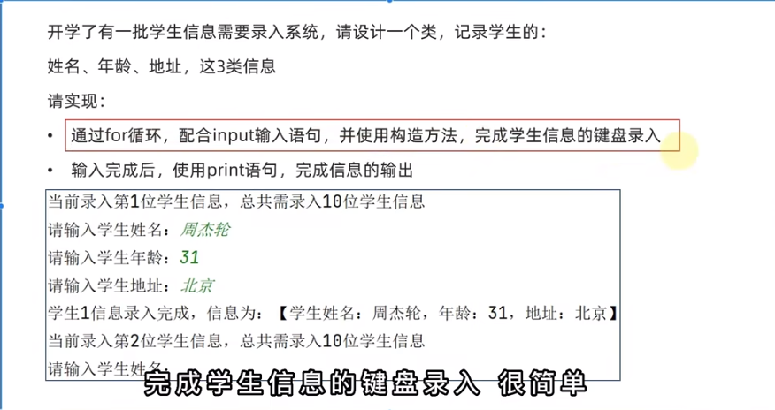

# 类与对象
>沉淀、分享、成长，让自己和他人都能有所收获！😄

## 类

```python
class Animal:
    def __init__(self, name):
        self.name = name

    def speak(self):
        print("This animal makes a sound.")
```

上述代码定义了一个名为`Animal`的类，其中`__init__`是一个特殊的方法（构造方法），用于初始化创建对象时所需的数据；`self`参数指向对象自身；`speak`是类的一个方法。

## 对象（Object）

**对象的创建：**
通过类可以创建多个具有相同特征（属性）和行为（方法）的对象，这个过程被称为实例化。

```markdown
```python
dog = Animal("Rex")
cat = Animal("Whiskers")

dog.speak()  # 输出: This animal makes a sound.
cat.speak()  # 输出: This animal makes a sound.
```
### 练习
```Python
class Student:
    name = None
    age = None
    sex = None

    def introduce(self):
        print(f'你好，我是一个学生{self.name}')
```
`成员方法访问成员变量必须使用self，外部传入的则不需要`

`类名需要大写`

`成员方法需要加self`

```python

import winsound
class Clock:
    id = None
    price = None

    def ring(self,speed,time):
        winsound.Beep(speed,time)


clock1 = Clock()
clock1.id = '11'
clock1.price = 222
clock1.ring(2000,2000)
```
## 可以通过init方法简化
具体如下
```python
import winsound
class Clock:
#各种=None 不再需要
    def __init__(self,id,price):  #可以直接通过self,xxx,xxx传入参数
        self.id = id    #需要在init方法下声明变量
        self.price=price  

    def ring(self,speed,time):
        winsound.Beep(speed,time)


clock1 = Clock('22',33)
clock1.ring(2000,2000)
```
## 练习
`需求`

`代码`
```python
class Student:
    def __init__(self,name,age,location):
        self.name = name
        self.age = age
        self.location = location

    def msg(self):
        print(f'学生{student_num}信息录入完成，信息位：【{self.name},{self.age},{self.location}】')

student_num=1
for student_num in range(1,100):
    if student_num <= 10:
        print(f'当前录入第{student_num}位学生信息，总共需录入10位学生信息')
        name1 = input('请输入学生姓名')
        age1 = input('请输入学生年龄')
        location1 = input('请输入学生地址')
        stu = Student(name1,age1,location1)
        stu.msg()
        student_num = student_num+1
    else:
        print('已完成录入')
        break
```


