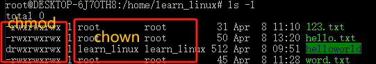

# 基本命令


## ls命令 显示指定目录的内容
1. -a 显示所有文件及目录 (. 开头的隐藏文件也会列出)
2. -d 只列出目录（不递归列出目录内的文件）。
-l 以长格式显示文件和目录信息，包括权限、所有者、大小、创建时间等。
3. -r 倒序显示文件和目录。
4. -t 将按照修改时间排序，最新的文件在最前面。
5. -A 同 -a ，但不列出 "." (目前目录) 及 ".." (父目录)
6. -F 在列出的文件名称后加一符号；例如可执行档则加 "*", 目录则加 "/"
7. -R 递归显示目录中的所有文件和子目录。

## cd命令 进入指定目录
1. cd 路径


## pwd命令 展示当前目录层级
1. pwd

## mkdir命令 创建文件夹 make directory
mkdir [-p] dirName
1. -p 确保目录名称存在，不存在的就建一个。


## touch命令 创建文件

touch [-acfm][-d<日期时间>][-r<参考文件或目录>] [-t<日期时间>][--help][--version][文件或目录…]

1. a 改变档案的读取时间记录。
2. m 改变档案的修改时间记录。
3. c 假如目的档案不存在，不会建立新的档案。与 --no-create 的效果一样。
4. f 不使用，是为了与其他 unix 系统的相容性而保留。
5. r 使用参考档的时间记录，与 --file 的效果一样
6. d 设定时间与日期，可以使用各种不同的格式。
7. t 设定档案的时间记录，格式与 date 指令相同。
8. --no-create 不会建立新档案。
9. --help 列出指令格式。
10. --version 列出版本讯息。

## cat命令 显示文件内容
cat [-AbeEnstTuv] [--help] [--version] fileName

1. -n 或 --number：由 1 开始对所有输出的行数编号。
2. -b 或 --number-nonblank：和 -n 相似，只不过对于空白行不编号。
3. -s 或 --squeeze-blank：当遇到有连续两行以上的空白行，就代换为一行的空白行。
4. -v 或 --show-nonprinting：使用 ^ 和 M- 符号，除了 LFD 和 TAB 之外。
5. -E 或 --show-ends : 在每行结束处显示 $。
6. -T 或 --show-tabs: 将 TAB 字符显示为 ^I。
7. -A, --show-all：等价于 -vET。
8. -e：等价于"-vE"选项；
9. -t：等价于"-vT"选项；

## more命令 显示文件，但文件过大时可支持翻页，cat不支持
more filename


## cp命令 复制文件\文件夹的命令 copy
cp 被复制的 复制到哪里

1. -a：此选项通常在复制目录时使用，它保留链接、文件属性，并复制目录下的所有内容。其作用等于 dpR 参数组合。
2. -d：复制时保留链接。这里所说的链接相当于 Windows 系统中的快捷方式。
3. -r 或 --recursive：用于复制目录及其所有的子目录和文件，如果要复制目录，需要使用该选项
4. -i 或 --interactive：在复制前提示确认，如果目标文件已存在，则会询问是否覆盖，回答 y 时目标文件将被覆盖。。
5. -u 或 --update：仅复制源文件中更新时间较新的文件。
6. -v 或 --verbose：显示详细的复制过程。
7. -p 或 --preserve：保留源文件的权限、所有者和时间戳信息。
8. -f 或 --force：强制复制，即使目标文件已存在也会覆盖，而且不给出提示。
9. -l：不复制文件，只是生成链接文件。

## mv命令 移动文件或文件夹 move
用法与cp类似

## rm命令 移除文件或文件夹 remove
用法与cp类似

## find命令 查找指定条件的文件
find [路径] [匹配条件] [动作]
路径 是要查找的目录路径，可以是一个目录或文件名，也可以是多个路径，多个路径之间用空格分隔，如果未指定路径，则默认为当前目录。

expression 是可选参数，用于指定查找的条件，可以是文件名、文件类型、文件大小等等。

匹配条件 中可使用的选项有二三十个之多，以下列出最常用的部份：

1. -name pattern：按文件名查找，支持使用通配符 * 和 ?。
2. -type type：按文件类型查找，可以是 f（普通文件）、d（目录）、l（符号链接）等。
3. -size [+-]size[cwbkMG]：按文件大小查找，支持使用 + 或 - 表示大于或小于指定大小，单位可以是 c（字节）、w（字数）、b（块数）、k（KB）、M（MB）或 G（GB）。
4. -mtime days：按修改时间查找，支持使用 + 或 - 表示在指定天数前或后，days 是一个整数表示天数。
5. -user username：按文件所有者查找。
6. -group groupname：按文件所属组查找。
动作: 可选的，用于对匹配到的文件执行操作，比如删除、复制等。

find 命令中用于时间的参数如下：

1. -amin n：查找在 n 分钟内被访问过的文件。
2. -atime n：查找在 n*24 小时内被访问过的文件。
3. -cmin n：查找在 n 分钟内状态发生变化的文件（例如权限）。
4. -ctime n：查找在 n*24 小时内状态发生变化的文件（例如权限）。
5. -mmin n：查找在 n 分钟内被修改过的文件。
6. -mtime n：查找在 n*24 小时内被修改过的文件。


## grep命令 查找特定关键词的内容并打印出来
1. grep 123* 123.txt ：查找123.txt中以123开头的内容
2. grep 123* 123.txt -n ：查找123.txt中以123开头的内容并显示在第几行

## wc命令 统计文件的行数、单词等信息
1. -c 统计大小
2. -m 统计字符数量
3. -l 统计行数
4. -w 统计单词数量

## | 管道符
前命令|后命令：前命令的输出可以作为后命令的输出，并可以多层嵌套

## echo命令 在shell中显示文本
1. 直接显示文本
```linux
echo "hello world"
```
2. 加入变量
```linux
name="John"
echo "My name is $name"
```
3. 加入命令
```linux
echo "My name is" `ls`
```
4. 结果重新赋值到文件中
```linux
echo "My name is" > 123.txt
```

5. 结果追加到文件中
```linux
echo "My name is" >> 123.txt
```
## tail命令 查看文件指定的内容
tail [-f -num] filename
1. -f是持续追踪，会持续显示变化
2. -num 查看对应的行数

## 权限相关
`r=4`

`w=2`

`x=1`

``777=4+2+1=rwx``


